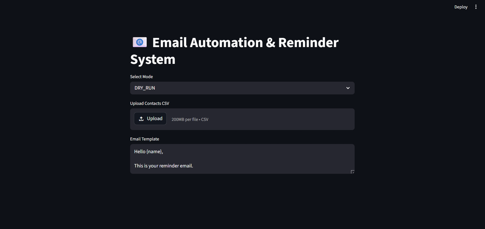
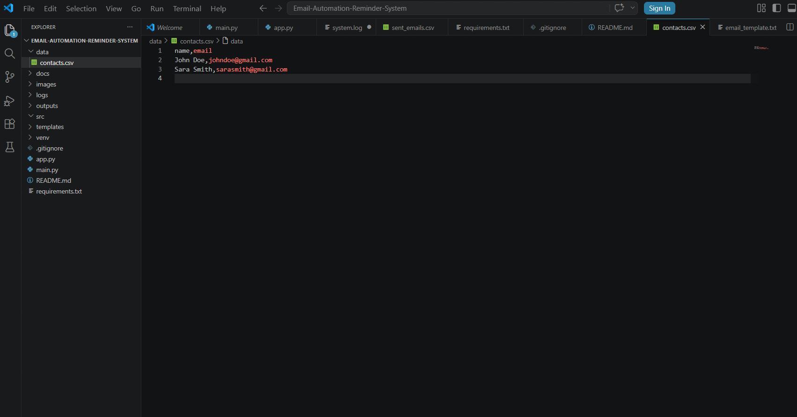
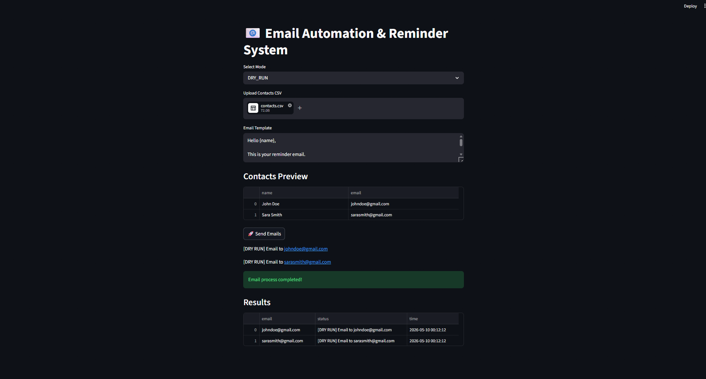
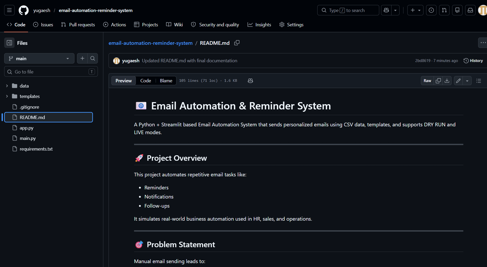

# 📧 Email Automation & Reminder System

A Python + Streamlit based Email Automation System that sends personalized emails using CSV data, templates, and supports DRY RUN and LIVE modes.

---

## 🚀 Project Overview

This project automates repetitive email tasks such as:
- Reminders
- Notifications
- Follow-ups

It simulates real-world business automation used in HR, sales, education, and operations teams.

---

## 🎯 Problem Statement

Manual email sending causes:
- Time consumption ⏳
- Human errors ❌
- Missed reminders 📉

This system solves it by automating the full email workflow.

---

## 💡 Features

- 📁 CSV-based contact management
- ✉️ Personalized email templates
- 🧪 DRY RUN mode (safe testing, no real emails)
- 🚀 LIVE mode (real email sending via SMTP)
- 🎛 Streamlit web dashboard
- 📝 Logging system
- 📊 Output tracking system
- ⚡ Simple and beginner-friendly design

---

## 🛠 Tech Stack

- Python 🐍
- Streamlit 🎈
- Pandas 📊
- SMTP (smtplib) 📧
- Email.message
- CSV Files 📁

---

## 📁 Project Structure

Email-Automation-Reminder-System/
│
├── app.py                  # Streamlit UI
├── main.py                 # Backend automation logic
│
├── data/
│   └── contacts.csv
│
├── templates/
│   └── email_template.txt
│
├── logs/
├── outputs/
├── images/
├── requirements.txt
└── README.md

---

## ⚙️ Installation & Setup

### 1️⃣ Clone Repository
git clone https://github.com/your-username/email-automation-reminder-system.git

cd email-automation-reminder-system

---

### 2️⃣ Install Dependencies
pip install -r requirements.txt

---

### 3️⃣ Run Streamlit App
streamlit run app.py

---

## 🧪 How It Works

1. Upload CSV file with contacts
2. Enter email template
3. Select mode:
   - DRY RUN → Simulation (safe)
   - LIVE → Sends real emails
4. Click "Send Emails"
5. View results in dashboard

---

## 📊 CSV Format

name,email
John Doe,john@example.com
Sara Smith,sara@example.com

---

## 📸 Screenshots

### 🖥 Streamlit UI

### 📁 CSV Data

### 📊 Output Results

### 🐙 GitHub Repository

---

## 🔐 Safety Notes

- Always use DRY RUN mode first
- LIVE mode requires Gmail App Password
- Never upload credentials to GitHub

---

## 📈 Learning Outcomes

This project demonstrates:
- Python automation
- Email integration using SMTP
- Streamlit UI development
- File handling with CSV
- Logging and reporting systems
- Real-world workflow automation

---

## 👨‍💻 Ideal For

- Python Developers
- Automation Engineers
- HR / Operations tools
- Internship projects
- College final year projects

---

## 🚀 Future Improvements

- Database integration (SQLite / MongoDB)
- Email scheduling system
- Authentication system
- Cloud deployment
- Advanced analytics dashboard

---

## 🙌 Author

Yugaesh